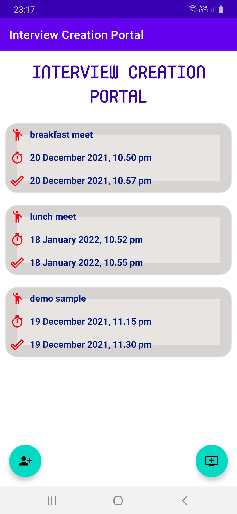
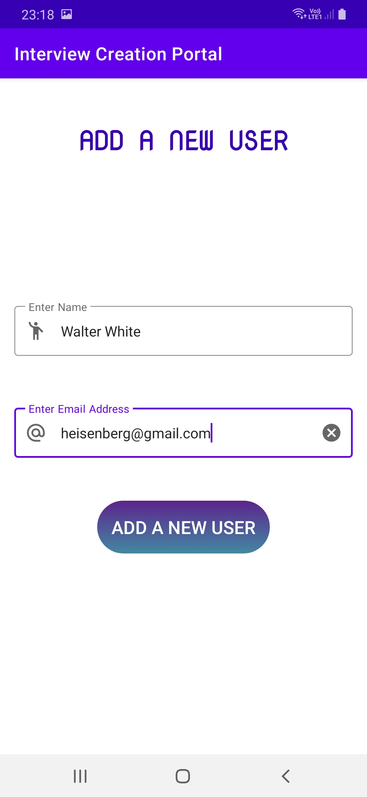
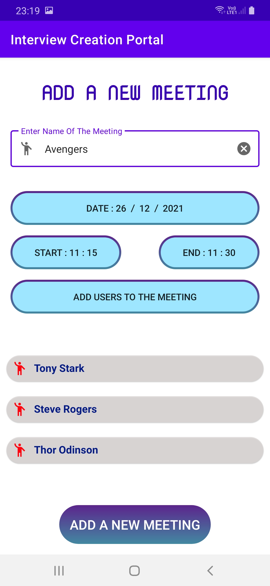
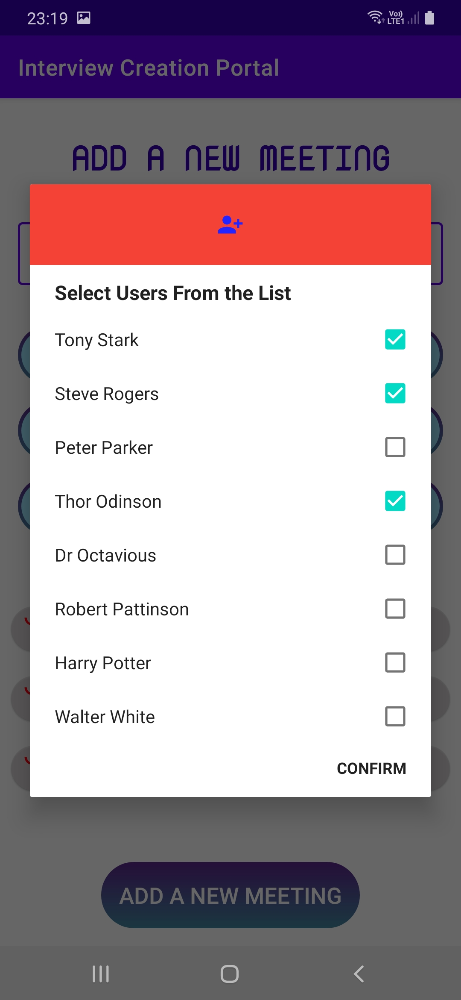
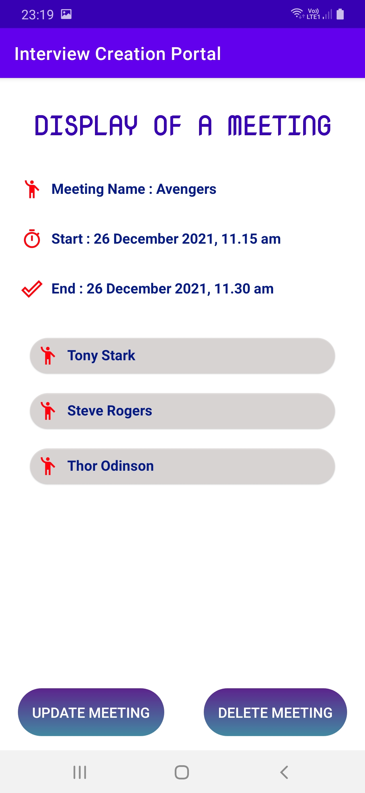
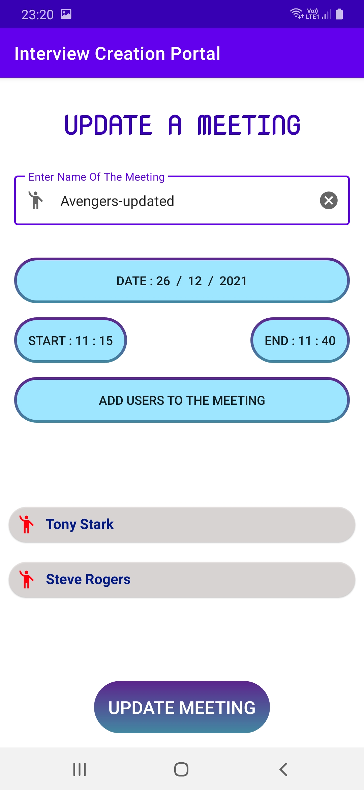
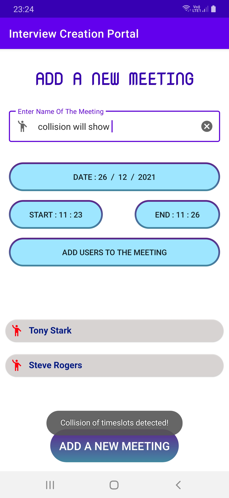
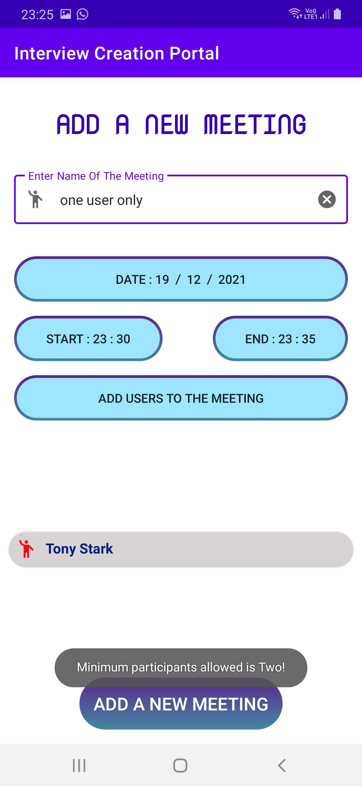
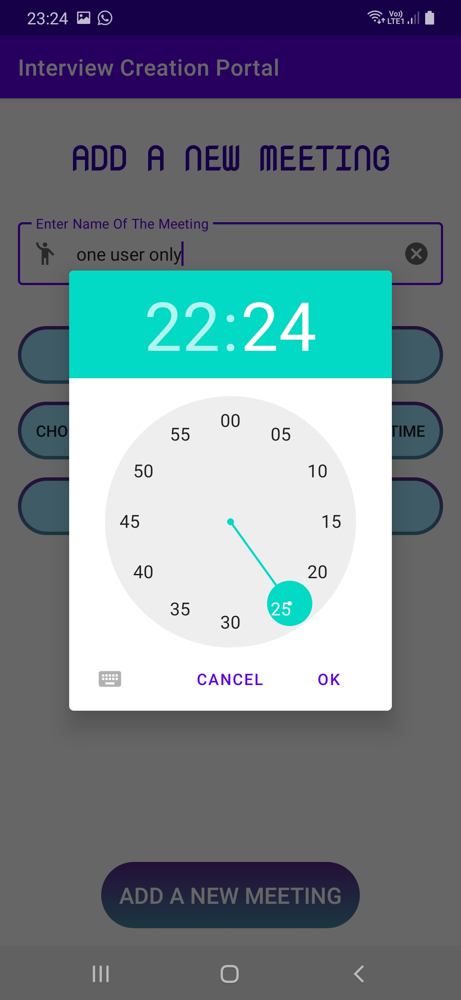
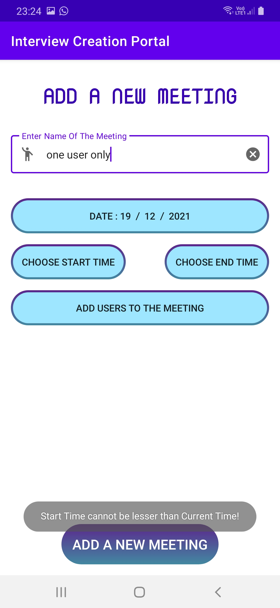

# Interview Creation Portal
## Description
Created an interiew scheduling portal, where there is option to add new user, and option to add a new meeting by selecting date and start time and end time, and also participants from the total participant list. All the scheduled interviews are displayed in a list, from which we can choose a particular interview and view, edit or delete them.

## Demo Video

* <a href="https://drive.google.com/file/d/1qaL-iDfvNvpt-xlOtIjuoBJUl9jfGSg8/view?usp=sharing"> **Video presentation post** </a>

## Usage
For installation and usage of this application

Navigate to: <a href="https://github.com/SayantanBanerjee16/Interview-Creation-Portal/tree/main/APK"> **/APK/Interview Portal - Sayantan Banerjee.apk** </a> and install it in your android phones. <Recommended Android 6.0(M) version and above>

## Application details

* This is the home screen of the application which displays all the scheduled interviews along with start time and end time. Clicking on it displays the interview in detail. There are also two floating action button, one for adding a new user, another for adding a new meeting.

* Upon clicking the add user screen floating action button from the home page, the below screen appears where we can add a new user in the server database. The fields are name and email. Appropriate validations are performed.

* Upon clicking the add a new meeting floating action button from the home page, the below screen appears where we can schedule a new meeting in the server database, by selecting date and start time and end time, and also participants from the total participant list, that we had added from Add User Screen. Appropriate validations are checked like the participants time should not collide, no of participants must be greater than or equal to two. Validations are performed on date and time fields also.

 

* Upon clicking a particular meeting from the home page, the following display screen appears which displays all the information about the meeting.

* In display screen, we have two options, one to edit the interview and other to directly delete the interview. Following is the image of update interview screen.

* Based on validation, the most hot topic to implement is no users time slot should collide in two different meetings. So before scheduling an interview, we need to check for collision.

* The other validation include number of selected participants must be greater than or equal to two. Or else error toast message is displayed.

* There are various validation done for time and dates. One such is shown as below, when we try to schedule start time which is lesser than current time, which can be verified from time displayed in status bar.

 

## Built With

* Android Studio
* Kotlin
* Firebase

## Authors
* <a href="https://www.linkedin.com/in/sayantan-banerjee-iiitgwalior/">  **Sayantan Banerjee** </a>
